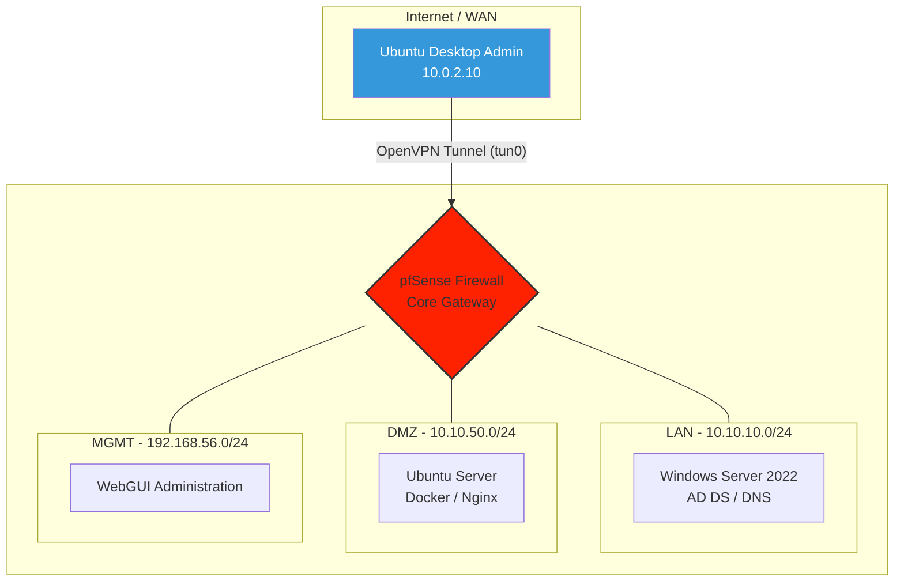

# Enterprise Network & Security Lab: Hybrid Infrastructure & Secure Access

## 🚀 Project Overview
This project demonstrates the design, implementation, and auditing of a segmented enterprise network infrastructure. Using **pfSense** as the core security gateway, the lab integrates a **Windows Server 2022** Active Directory environment with **Linux-based microservices** (Docker/Nginx) in a hardened DMZ. 

The primary goal was to achieve a **Zero-Trust** management model where sensitive administrative interfaces are only accessible via a cryptographically secure **OpenVPN** tunnel, effectively mitigating common hypervisor-level security leaks.

## 🏗️ Network Architecture
The infrastructure is divided into four distinct security zones:
* **WAN (External):** Simulated public network with strict "Deny All" ingress policies.
* **LAN (Internal):** Corporate segment hosting the Identity Provider (Active Directory `shield.corp`).
* **DMZ (Public Services):** Isolated segment for web services (Docker/Nginx).
* **MGMT (Administrative):** A private management network used exclusively for firewall and server auditing.

## 🛠️ Tech Stack & Skills
* **Firewall/Routing:** pfSense (VLANs, NAT, OpenVPN, Stateful Inspection).
* **Identity Management:** Windows Server 2022 (AD DS, DNS, DHCP).
* **Containerization:** Docker Engine & Docker Compose (Nginx Alpine).
* **Operating Systems:** Ubuntu Server 24.04 (Hardened), Windows Server 2022 (Desktop Experience).
* **Security Auditing:** Traceroute analysis, Firewall log correlation, and GPO forensics.

## 🧠 Key Technical Challenges & Solutions
### 1. The Hypervisor Routing Leak
* **Challenge:** Identified a security flaw where the VirtualBox NAT engine implicitly routed management traffic, bypassing pfSense's WAN rules.
* **Solution:** Developed a custom Bash script (`vpn-start.sh`) that programmatically isolates the host by removing default gateways and enforcing traffic encapsulation through the `tun0` interface.

### 2. Linux Routing & Permission Conflict
* **Challenge:** Persistent `route add failed` errors when initializing the VPN client on Ubuntu Desktop.
* **Solution:** Implemented the `--route-noexec` flag combined with manual route injection to maintain strict control over the system's routing table.

## 📂 Repository Structure
* `assets/`: Network diagrams and evidence screenshots.
* `docs/`: Detailed step-by-step documentation for all 10 Phases.
* `scripts/`: Automation scripts for secure VPN management (`vpn-start.sh`, `vpn-stop.sh`, `ipconfig.sh`).

---
*Developed for professional showcase by Carles Comas Pérez*