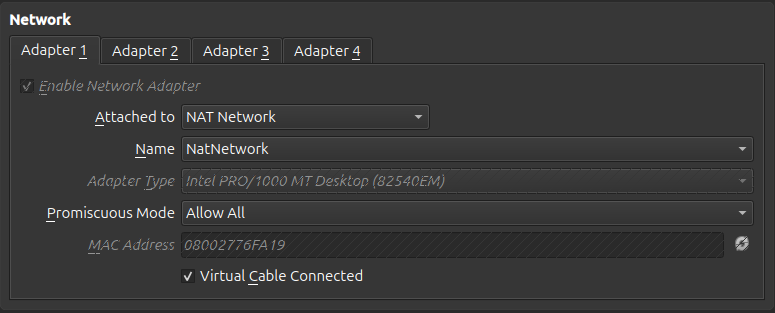
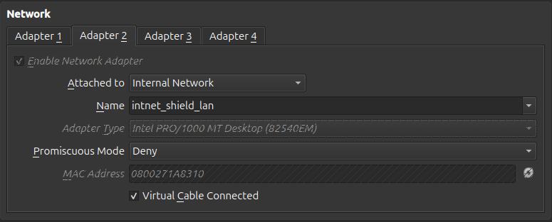
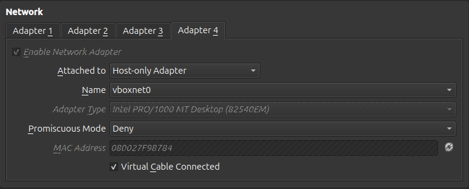
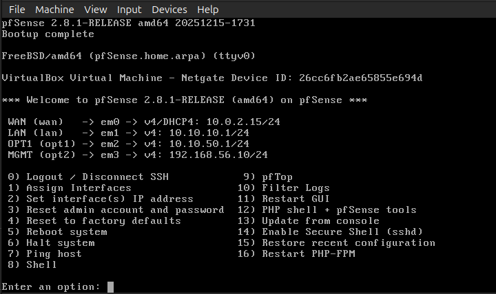
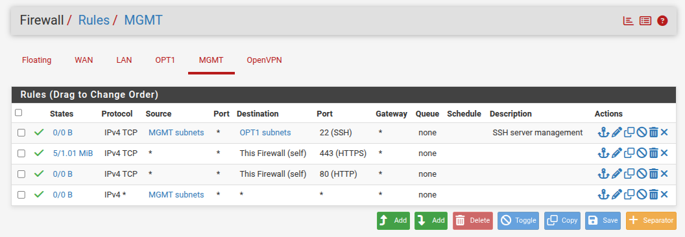
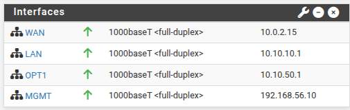

# Phase 01: pfSense Installation & Base Configuration

## 🎯 Objective
The primary goal of this phase was to deploy and configure the core security gateway: the **pfSense CE** firewall. This virtual appliance manages traffic between four distinct security zones, acting as the perimeter defense and the "brain" of the entire network infrastructure.

## ⚙️ Virtual Hardware Specifications
The firewall was deployed as a Virtual Machine (VM) in VirtualBox with the following specifications to ensure stability and efficiency:
* **Operating System:** FreeBSD (64-bit).
* **RAM:** 1024 MB.
* **CPU:** 1 Core.
* **Storage:** 16 GB VDI.
* **Network Interface:** 
  * Adapter 1: NAT Network (`Simulated Wan`).
  * Adapter 2: Internal Network (`intnet_shield_lan`).
  * Adapter 3: Internal Network (`intnet_dmz`).
  * Adapter 4: Host-Only Adapter (`vboxnet0`).

## 🛠️ Implementation & Post-Install Configuration

### 1. Interface and IP Assignment
Once the OS was live, interfaces were assigned to their physical adapters and static IPs were configured via the console:
* **WAN (em0):** Assigned via **DHCP (10.0.2.15/24)**.
* **LAN (em1):** Static IP **10.10.10.1/24**. **DHCP Disabled** to avoid "Rogue DHCP" conflicts with the future Windows Domain Controller.
* **DMZ (em2):** Static IP **10.10.50.1/24**. **DHCP Enabled** (Range: 10.10.50.100 - 10.10.50.200) for rapid server deployment.
* **MGMT (em3):** Static IP **192.168.56.10/24**.

### 2. Network Segmentation Logic
* **LAN Isolation:** In an enterprise environment, identity providers (Active Directory) must manage network services. Disabling DHCP on pfSense ensures the Windows DC remains the sole authority for IP assignment and DNS.
* **DMZ Scalability:** Enabling DHCP on the DMZ allows new services (like Ubuntu/Docker) to obtain connectivity automatically, simplifying the deployment of microservices.

## ⚠️ Challenges & Troubleshooting

### The Admin Lockout Issue
**Problem:** By default, pfSense security policies block WebGUI access from any interface other than the LAN. 
**Solution:** I accessed the pfSense shell and temporarily disabled the firewall filter using `pfctl -d`. This allowed initial access to create a permanent **Pass Rule** on the MGMT interface for HTTPS traffic.

## ✅ Validation
* **Interface Status:** Verified via console that all 4 interfaces are "Up" with correct static/dynamic addresses.
* **Management Access:** Confirmed the WebGUI is operational at `https://192.168.56.10` from the host machine.

---
[⬅️ Back to README](../README.md)