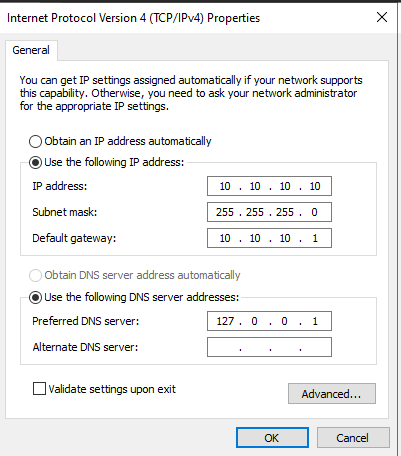
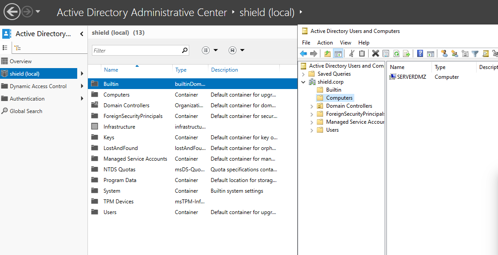
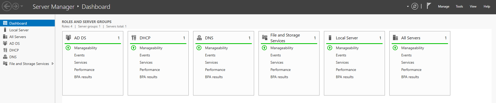

# Phase 02: Windows Server 2022 & Active Directory Deployment

## 🎯 Objective
The goal of this phase was to implement a centralized identity and resource management system. By deploying **Windows Server 2022** as a Domain Controller (DC), the infrastructure gains control over users, computers, and security policies (GPOs) for the **`shield.corp`** domain.

## ⚙️ Virtual Hardware Specifications
Given the requirements of Windows Server 2022, the VM was configured to ensure smooth performance:
* **Operating System:** Windows Server 2022 Standard (Desktop Experience).
* **RAM:** 2048 MB.
* **CPU:** 2 Cores.
* **Storage:** 50 GB VDI.
* **Network Interface:** Adapter 1 - Internal Network (`intnet_shield_lan`).

## 🛠️ Implementation Process

### 1. Network Configuration & DNS Identity
A persistent static IP is mandatory for a Domain Controller. The following settings were applied:
* **IP Address:** `10.10.10.10`
* **Default Gateway:** `10.10.10.1` (pfSense LAN).
* **DNS Preferred:** `127.0.0.1` (The server is its own name resolver).
* **DNS Forwarders:** Configured to point to `10.10.10.1` to allow external resolution via the pfSense gateway.

### 2. AD DS & DHCP Services
The server was promoted to a Domain Controller for the `shield.corp` forest. Additionally, the DHCP role was installed to centralize LAN management:
* **DHCP Scope Name:** LAN.
* **IP Range:** 10.10.10.100 - 10.10.10.200.
* **Option 003 (Router):** 10.10.10.1.
* **Option 006 (DNS Servers):** 10.10.10.10 (Clients must point to the DC for domain functionality).
* **Option 015 (Domain Name):** `shield.corp`.

## ⚠️ Challenges & Troubleshooting
* **Kerberos Time Sync:** AD requires strict time alignment. I verified the Windows Time service was synchronized with the host to prevent authentication failures.
* **External Resolution:** Resolved initial connectivity issues by setting the pfSense LAN IP as a DNS Forwarder, bridging the gap between internal AD names and internet queries.

## ✅ Validation
* **Domain Integrity:** Confirmed successful forest creation and `SHIELD\Administrator` login via PowerShell and Server Manager.
* **Service Audit:** Verified that test clients receive IPs within the defined scope and can resolve the `shield.corp` SRV records.

---
[⬅️ Back to README](../README.md)