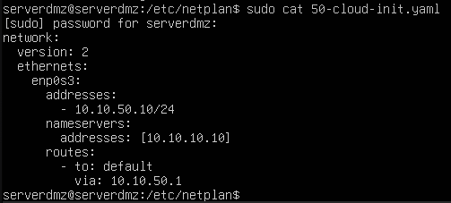
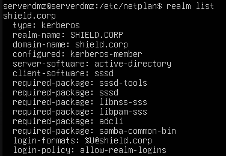

# Phase 03: Hybrid Server Deployment (Linux DMZ + Windows AD)

## 🎯 Objective
The primary goal of this phase was to deploy an **Ubuntu Server** in an isolated **DMZ zone** and integrate it into the **`shield.corp`** corporate domain. This establishes a centralized authentication model where Linux resources are managed by the Windows Active Directory, while hosting a functional web service.

## ⚙️ Virtual Hardware Specifications
Given the requirements of Ubuntu Server 24.04, the VM was configured to ensure smooth performance:
* **Operating System:** Ubuntu Server 24.04 LTS (64-bit).
* **RAM:** 2048 MB.
* **CPU:** 1 Core.
* **Storage:** 25 GB VDI.
* **Network Interface:** Adapter 1 - Internal Network (`intnet_dmz`).

## 🛠️ Implementation Process

### 1. Static Network Configuration (Netplan)
To ensure infrastructure stability and domain reachability, the network was transitioned from DHCP to a static configuration. This is critical for servers participating in an Active Directory forest:
* **Static IP:** `10.10.50.10/24`.
* **DNS Gateway:** `10.10.10.10` (Pointed to Windows DC for domain resolution).
* **Default Route:** `10.10.50.1` (pfSense DMZ interface).

### 2. Active Directory Integration
The server was joined to the `shield.corp` domain to allow centralized identity management:
* **Tools used:** `realmd`, `sssd`, `adcli`, and `samba-common-bin`.
* **Domain Discovery:** Verified domain visibility via `realm discover shield.corp`.
* **Domain Join:** Executed `sudo realm join -U Administrator shield.corp` to create the Computer Object in the AD.
* **PAM Configuration:** Enabled automatic home directory creation for domain users upon their first login.

### 3. Web Service Deployment (Apache2)
A native **Apache2** web server was deployed to test service accessibility within the DMZ segment:
* **Installation:** `sudo apt install -y apache2`.
* **Service Management:** Verified the service status as `active (running)`.

## ⚠️ Technical Challenges & Troubleshooting

### Cross-Segment Routing Leak
**Problem:** The host machine could not reach the DMZ network (`10.10.50.0/24`) even with permissive firewall rules, as it attempted to route traffic through its default gateway instead of the lab gateway.
**Solution:** Injected a manual static route on the host machine using the command: `sudo ip route add 10.10.50.0/24 via 192.168.56.10`.

### Browser Security Policies (Brave vs. Firefox)
**Problem:** Modern Chromium-based browsers like Brave rejected the connection to the server's IP due to aggressive HSTS and security policies for non-HTTPS local traffic.
**Solution:** Switched to **Mozilla Firefox**, which allowed access to the local lab HTTP landing page, successfully displaying the Apache "It works!" default site.

### Time Drift (Kerberos Authentication)
**Problem:** The initial `realm join` failed because the Linux server's time was out of sync with the Domain Controller.
**Solution:** Aligned the system time with the DC to satisfy the 5-minute maximum drift required by the Kerberos protocol.

## ✅ Validation & Evidence
* **Identity Audit:** Running `id Administrator@shield.corp` successfully returned the correct UID/GID and security groups from the Windows DC.
* **Connectivity Proof:** Successful access to the Apache landing page via IP `10.10.50.10` from the management host.
* **AD Verification:** Confirmed the server `SRV-WEB-01` (or equivalent) appears in the "Computers" Container of the Windows Active Directory.

---
[⬅️ Back to README](../README.md)