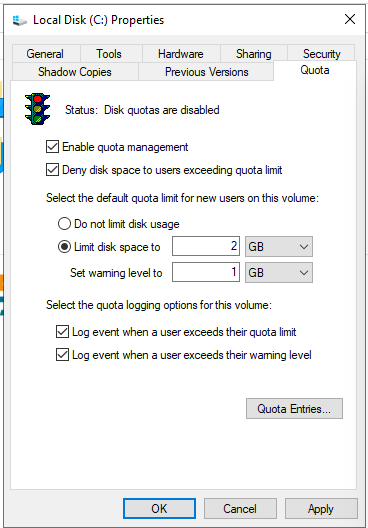
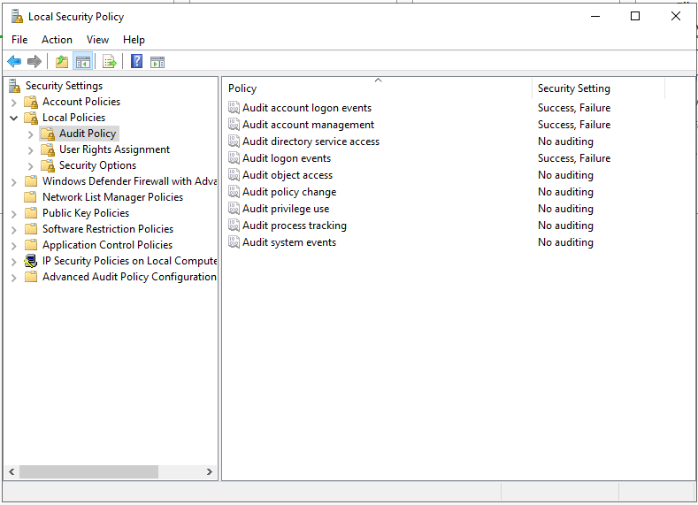
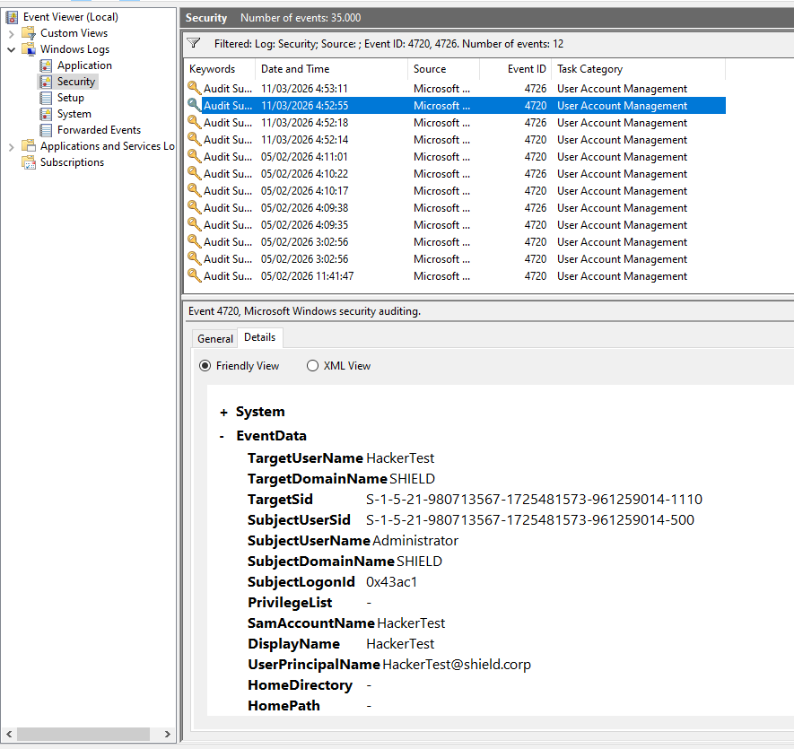

# Phase 04: Active Directory Hardening & Resource Control

## 🎯 Objective
The primary goal of this phase was to implement resource restriction policies and activate forensic auditing mechanisms to monitor activity on the Domain Controller. This ensures the integrity and availability of the centralized identity system.

## 🛠️ Implementation Process

### 1. Storage Management (NTFS Disk Quotas)
To mitigate Denial of Service (DoS) risks caused by disk exhaustion, quotas were implemented at the NTFS file system level on the Local Disk (C:). This prevents a single user from saturating the server storage, which could cause critical services like the Active Directory database (`NTDS.dit`) to crash.
* **Limit disk space to:** 2 GB (Hard limit: prevents writing beyond this point).
* **Set warning level to:** 1 GB (Soft limit: alerts the administrator).
* **Log events:** Activated to record both warnings and quota violations in the system logs.

### 2. Audit Policy Implementation (GPO)
By default, Windows Server optimizes performance by not logging critical changes. To enable forensic surveillance, the **Default Domain Controllers Policy** was modified.
* **GPO Path:** `Computer Configuration > Policies > Windows Settings > Security Settings > Local Policies > Audit Policy`
* **Activated Policies (Success & Failure):**
    1. **Audit account management:** Logs the creation, modification, or deletion of users and groups.
    2. **Audit logon events:** Logs successful and failed access attempts (crucial for detecting brute-force attacks).
* **Application Command:** The policy was enforced immediately using the `gpupdate /force` command.

## ✅ Validation & Forensic Proof
A field test (Proof of Concept) was conducted to verify that the auditing system was correctly capturing security events.
* **Action Performed:** A fictitious user named `HackerTest` was created and immediately deleted.
* **Analysis Tool:** Windows Event Viewer (`eventvwr.msc`).
* **Forensic Evidence Found (Security Log):**
    * **Event ID 4720:** "A user account was created". The log detailed the exact time and the author (`Administrator`).
    * **Event ID 4726:** "A user account was deleted". This successfully closed the lifecycle of the audited object.

## 🛡️ Current Project Status
With the completion of Phase 4, the Shield Corp infrastructure has reached the following milestones:
1. **Network Segregation:** Isolated traffic between LAN, DMZ, and MGMT via pfSense.
2. **Centralized Identity:** Windows Server 2022 managing DNS, DHCP, and Users.
3. **Hybrid Services:** Ubuntu Web Server successfully integrated into the AD domain.
4. **Governance:** Security logs active and storage controls implemented.

---
[⬅️ Back to README](../README.md)