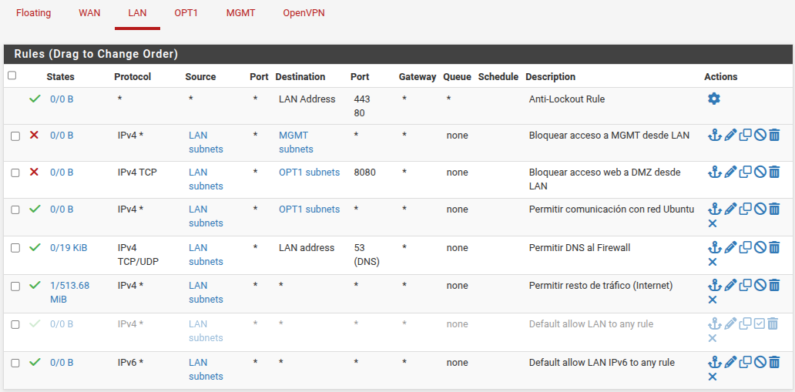
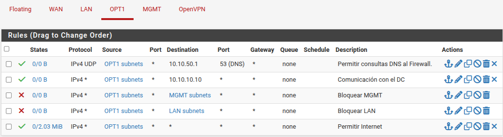
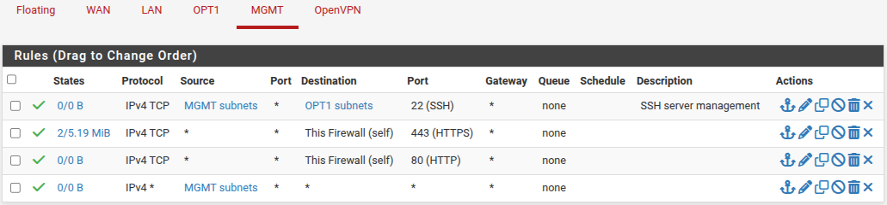
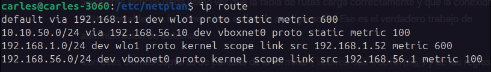
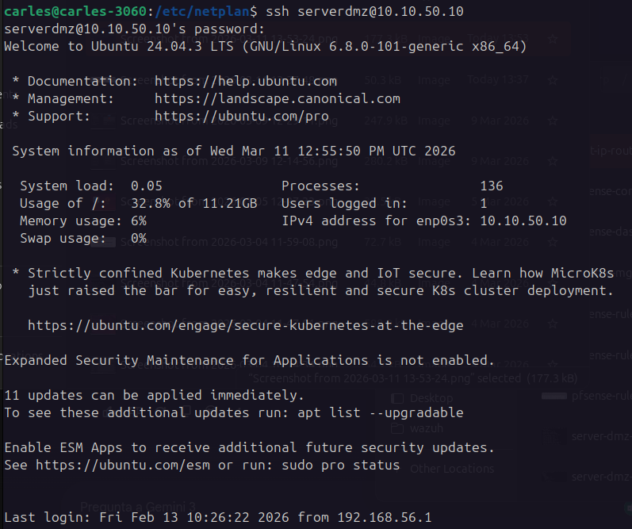

# Phase 05: Firewall Sanitization & Secure SSH Connectivity

## 🎯 Objective
This phase focuses on securing the network perimeter by implementing strict firewall rules across all zones (WAN, LAN, DMZ, MGMT) based on the "Zero Trust" and "First Match Wins" principles. Additionally, it establishes a secure, routed SSH connection from the Management host to the isolated DMZ server.

## ⚙️ Infrastructure Scope
The configurations in this phase interact with the following deployed nodes:
* **pfSense Gateway:** Traffic filtering and stateful inspection engine.
* **Ubuntu Server (DMZ):** Target node for SSH connectivity.
* **Ubuntu Desktop (MGMT):** Administrative host requiring static routing.

## 🛠️ Part 1: Firewall Rule Sanitization (pfSense)

### 1. Core Operating Principles
* **First Match Wins:** pfSense processes rules from top to bottom. Once a packet matches a rule, the action (Pass/Block) is executed, and further processing stops. Block rules are placed at the top, followed by general Pass rules.
* **Ingress Filtering:** Rules are applied exclusively to incoming traffic on the interface the packet enters.
* **Stateful Inspection:** The firewall maintains a "State Table". Outbound traffic creates a state, allowing the return traffic to automatically bypass the default deny policy on the WAN.

### 2. Interface Configurations

#### WAN (Internet)
**Policy:** Default Deny (Total Block).
* No explicit pass rules are configured. This guarantees that no external entity can initiate a connection to the internal network.

#### LAN (Corporate Network)
**Policy:** Medium Trust. Allows navigation and domain management, but strictly protects the MGMT network and isolates specific DMZ web services.

| Order | Action    | Protocol     | Source      | Destination  | Port     | Description                             |
| :---- | :-------- | :----------- | :---------- | :----------- | :------- | :-------------------------------------- |
| 1     | Pass      | *            | *           | LAN Address  | 443, 80  | Anti-Lockout Rule                       |
| 2     | **Block** | IPv4 *       | LAN subnets | MGMT subnets | *        | Block access to MGMT from LAN           |
| 3     | **Block** | IPv4 TCP     | LAN subnets | OPT1 subnets | 8080     | Block web access to DMZ from LAN        |
| 4     | Pass      | IPv4 *       | LAN subnets | OPT1 subnets | *        | Allow communication with Ubuntu network |
| 5     | Pass      | IPv4 TCP/UDP | LAN subnets | LAN address  | 53 (DNS) | Allow DNS to Firewall                   |
| 6     | Pass      | IPv4 *       | LAN subnets | *            | *        | Allow all other traffic (Internet)      |
| 7     | Pass      | IPv6 *       | LAN subnets | *            | *        | Default allow LAN IPv6 to any rule      |



#### OPT1 (DMZ / Ubuntu Server)
**Policy:** Zero Trust. Minimal functionality allowed. Containment model applied.

| Order | Action    | Protocol | Source       | Destination  | Port     | Description                   |
| :---- | :-------- | :------- | :----------- | :----------- | :------- | :---------------------------- |
| 1     | Pass      | IPv4 UDP | OPT1 subnets | 10.10.50.1   | 53 (DNS) | Allow DNS queries to Firewall |
| 2     | Pass      | IPv4 *   | OPT1 subnets | 10.10.10.10  | *        | Communication with the DC     |
| 3     | **Block** | IPv4 *   | OPT1 subnets | MGMT subnets | *        | Block MGMT                    |
| 4     | **Block** | IPv4 *   | OPT1 subnets | LAN subnets  | *        | Block LAN                     |
| 5     | Pass      | IPv4 *   | OPT1 subnets | *            | *        | Allow Internet                |



#### MGMT (Management)
**Policy:** God Mode. Total visibility with unidirectional security.

| Order | Action | Source   | Destination      | Justification                                                                                 |
| :---- | :----- | :------- | :--------------- | :-------------------------------------------------------------------------------------------- |
| 1     | Pass   | MGMT Net | Firewall (HTTPS) | Web access to the pfSense console.                                                            |
| 2     | Pass   | MGMT Net | Any              | Allows SSH/RDP access to all zones. Incoming traffic is blocked by rules on other interfaces. |




### 3. Security Theory: Internal Surface vs. DMZ
Integrating a DMZ server into the Active Directory creates a communication path to the DC. However, this is heavily restricted (Host-to-Host, Port Filtering). Comparatively, a compromised Office PC on the LAN poses a higher "Insider Threat" due to broader network permissions, making the DMZ containment model crucial for exposed services.

---

## 🛠️ Part 2: Secure SSH Implementation

To securely access the DMZ server from the Management host, a three-step workflow was implemented.

### 1. Server Configuration (Ubuntu Server)
The SSH service was activated and permitted through the host-level firewall:
* Started the process: `sudo systemctl start ssh`.
* Enabled on boot: `sudo systemctl enable ssh`.
* Opened internal firewall: `sudo ufw allow ssh`.

### 2. Firewall Authorization (pfSense)
A specific Pass rule was created on the MGMT interface to allow TCP traffic on Port 22 toward the OPT1 network (10.10.50.0/24).

### 3. Host Routing Configuration (Ubuntu Desktop)
By default, the host machine cannot reach the `10.10.50.0/24` subnet because it is behind pfSense. A static route was injected to define the gateway.

#### Persistent Route via Netplan
To survive reboots, the route was hardcoded into the Network Manager using Netplan.
**File:** `/etc/netplan/02-virtualbox.yaml`

```yaml
network:
  version: 2
  ethernets:
    vboxnet0:
      addresses:
        - 192.168.56.1/24
      routes:
        - to: 10.10.50.0/24
          via: 192.168.56.10
```
*Applied via:* `sudo netplan apply`


## ✅ Validation
The connectivity was successfully validated by checking the routing table with `ip route show` and initiating an SSH session from the MGMT host:
`ssh serverdmz@10.10.50.10`






---
[⬅️ Back to README](../README.md)