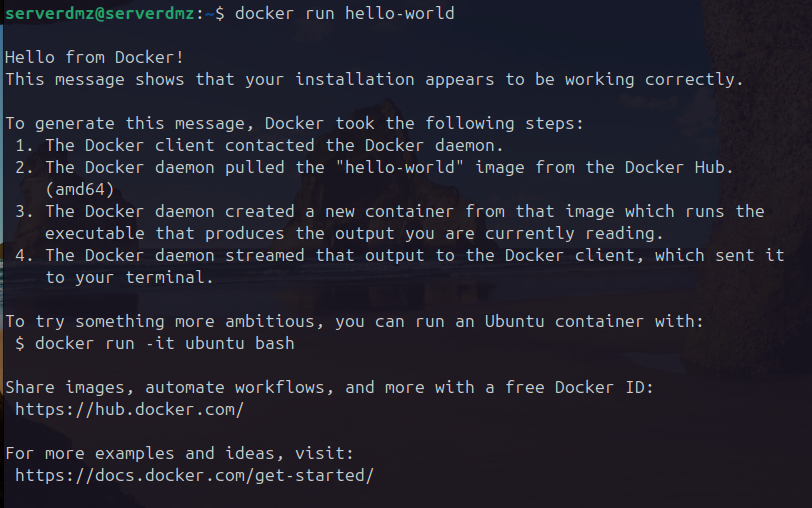

# Phase 06: Docker Runtime Implementation & Container Architecture

## 🎯 Objective
The objective of this phase was to transition the Ubuntu Server (10.10.50.10) located in the DMZ into a dedicated Container Node capable of deploying microservices. Instead of using default Ubuntu repositories, the official Docker repository was integrated to ensure the latest security updates and functionalities.

## 🏗️ Architecture & Pre-Requisites: Native vs. Containerized Services

Before installing Docker, a critical architectural change was required regarding the native Apache server installed in Phase 3.

### 1. TCP Socket & Port Binding Conflict
During Phase 3, a native Apache daemon was installed directly on the host operating system, establishing an active listening socket on TCP Port 80. When attempting to deploy containerized web services, the Docker Engine requires binding the host's Port 80 to the container's internal network to route ingress HTTP traffic. 

Because two independent processes cannot simultaneously bind to the same network interface and port, a socket conflict (`address already in use`) occurs. To resolve this, the native Apache service was stopped and disabled, releasing the TCP port and allowing Docker to take full control of the web traffic routing.

### 2. The Execution Stack
* **Incorrect Assumption:** Linux -> Apache -> Docker.
* **Actual Architecture:** Linux (Host OS) -> Docker Engine (Daemon) -> Container (Isolated App).
* **Advantage:** Unlike native installations that scatter files across `/etc/` and `/var/www`, Docker isolates dependencies within closed containers. The Ubuntu VM now acts purely as a Host engine, ensuring total portability via `docker-compose.yml`.

## 🛠️ Implementation Process

### 1. Dependency Preparation
Tools were installed to allow the OS to trust external sources and handle cryptographic keys securely.

`sudo apt update && sudo apt upgrade -y` 

`sudo apt install -y ca-certificates curl gnupg lsb-release`

* `ca-certificates`: Verifies SSL/TLS certificates from Docker servers.
* `curl`: Command-line tool for data transfer.
* `gnupg`: Encryption software to manage digital signatures.
* `lsb-release`: Utility to identify the specific Ubuntu codename.

### 2. The Chain of Trust (Security)
To prevent unauthorized software execution, Docker's official GPG key was imported, establishing a strict chain of trust.

`sudo mkdir -p /etc/apt/keyrings`
`curl -fsSL https://download.docker.com/linux/ubuntu/gpg | sudo gpg --dearmor -o /etc/apt/keyrings/docker.gpg`

* `gpg --dearmor` converts the cryptographic key into a binary format readable by `apt`.

### 3. Repository Configuration
The system was pointed to the official Docker servers, strictly bound to the imported GPG key.

`echo "deb [arch=$(dpkg --print-architecture) signed-by=/etc/apt/keyrings/docker.gpg] https://download.docker.com/linux/ubuntu $(lsb_release -cs) stable" | sudo tee /etc/apt/sources.list.d/docker.list > /dev/null`

* `signed-by`: Ensures that even if the repository is compromised, the OS will reject unsigned packages.

### 4. Engine Installation
*Note: To avoid conflicts in Ubuntu 24.04 with pre-installed packages, `sudo apt remove docker-compose-v2 && sudo apt --fix-broken install` was executed*

`sudo apt update`
`sudo apt install -y docker-ce docker-ce-cli containerd.io docker-compose-plugin`

* `docker-ce`: The core Daemon engine.
* `docker-ce-cli`: The command-line client.
* `containerd.io`: The low-level container runtime.
* `docker-compose-plugin`: Orchestration tool for multiple containers.

### 5. Privilege Management
By default, Docker requires `root`. To avoid using `sudo` for every command, the administrative user was added to the `docker` group.

`sudo groupadd docker`

`sudo usermod -aG docker $USER`
`newgrp docker`

* `-aG`: Appends the user without removing them from existing groups.
* `newgrp`: Reloads group permissions in the current session without a reboot.

## ✅ Auditing & Verification

To prove the configuration was successful, the following forensic checks were performed:

1. **Group Verification:** `id` confirmed the presence of `docker` in the group list.
2. **Socket Permissions:** `ls -l /var/run/docker.sock` confirmed ownership: `srw-rw---- 1 root docker`.
3. **Service Activation:** `sudo systemctl enable --now docker` ensured the daemon survives reboots.

### The "Smoke Test" & Networking View

`docker run hello-world`

**What this command actually validates:**
1. **Client to Engine:** Confirms the user has correct permissions to communicate with the local socket.
2. **Egress Firewall Rules:** The engine reached out to Docker Hub, proving the pfSense DMZ rules successfully allow outbound internet traffic for package downloads.
3. **Isolation Engine:** Docker successfully downloaded the image, instantiated an isolated container, executed the payload, and returned the output to the host terminal.

---
[⬅️ Back to README](../README.md)