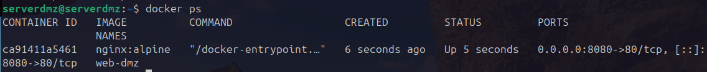
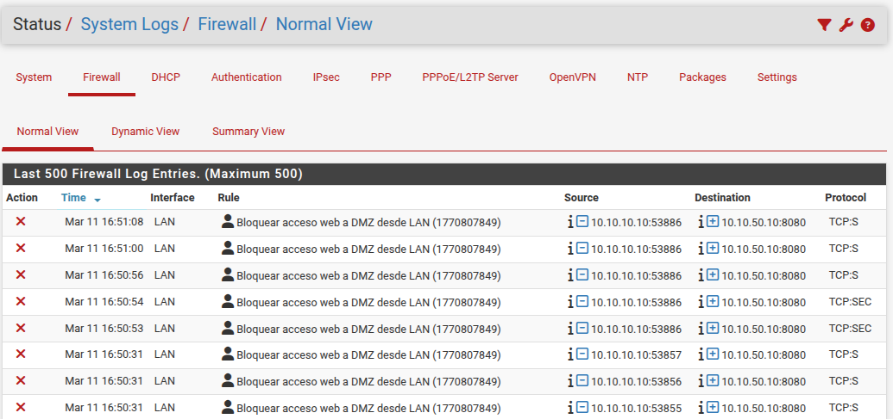

# Phase 07: Service Deployment & Network Auditing

## 🎯 Objective
The objective of this phase was to publish a real web service in the DMZ and validate that the network segmentation (firewalling) configured in previous phases correctly protects the infrastructure.

## 🛠️ Implementation Process

### 1. Web Server Deployment (Nginx)
The first step was to spin up a container to act as our "Web App". Nginx Alpine was chosen because it is the industry standard for being lightweight and secure.


The following command was executed on the Ubuntu Server:
```bash
docker run -d --name web-dmz -p 8080:80 nginx:alpine
```

**Didactic Explanation:**
* **`-d` (Detached):** The container runs in the background. As an administrator, this allows you to continue using the terminal while the service remains active.
* **`--name web-dmz`:** We label the container. In production environments, using descriptive names is vital for automation and maintenance.
* **`-p 8080:80` (Port Mapping):**
    * **`80` (Internal):** The standard HTTP port inside the container.
    * **`8080` (External):** The port opened on the physical Ubuntu host IP (`10.10.50.10`).
    * **Logic:** It acts as a tunnel. Everything arriving at port 8080 of the physical server is redirected to port 80 of the container.
    
* **`nginx:alpine`:** The Alpine distribution is used to reduce the attack surface. Less unnecessary code means fewer potential vulnerabilities.

### 2. Service Verification
Before testing the network, we confirmed that the process was "healthy" within the host.

```bash
docker ps
```
* **Check:** It must be verified that the `STATUS` column shows `Up` and that the port mapping correctly displays `0.0.0.0:8080->80/tcp`.




## ⚠️ Challenges & Troubleshooting

### The LAN "Leak" Problem
During testing, it was detected that the Windows Server (DC) on the LAN could access the web service in the DMZ, which violated our "network isolation" security policy.

**The Diagnosis (Root Cause):**
Reviewing the LAN interface rules in pfSense, a general rule was found: `Pass | Source: LAN Net | Destination: OPT1 Net | Port: *`. This rule failed our security posture because it allowed all traffic to the Ubuntu subnet, including the new 8080 port of our web service.

**The Solution (First-Match Logic):**
In pfSense, rules are read from top to bottom. The first rule that matches the packet is applied, and the rest are ignored.


To correct this, the following configuration was applied:
1. Created a specific `BLOCK` rule for port 8080 towards the DMZ.
2. Placed it *above* the general pass rule.
3. **Result:** When the DC attempts to access the web, pfSense finds the "Block" rule first and stops the packet before it reaches the "Allow" rule.

**Didactic Lesson:** Always place the most specific rules (Blocks or single-port permissions) at the top, and the most general rules (Allow all) at the bottom.

## 🔍 Log Auditing (Network vs. Application)
As administrators, we must know how to cross-reference data between what the Firewall sees and what the Server sees.

### A. Application Log (Docker)
To see who successfully entered the service:
```bash
docker logs -f web-dmz
```
* **Result:** Only requests from the Management network (MGMT) are visible, as they have full permission. HTTP 200 (Success) codes appear.

### B. Network Log (pfSense)
If the Windows Server attempts to enter, Docker will not log anything. Why? Because the packet never reaches the server; it dies in the firewall.
* **Verification:** In pfSense (`Status > System Logs > Firewall`), we looked for the red marks. There we found the proof of the failed attempt from the DC (`10.10.10.10`) towards port 8080.



---
[⬅️ Back to README](../README.md)