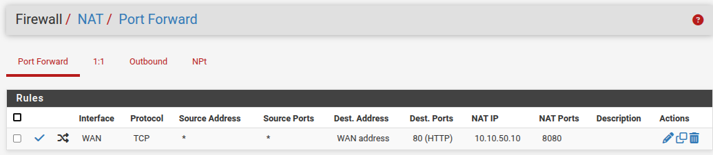
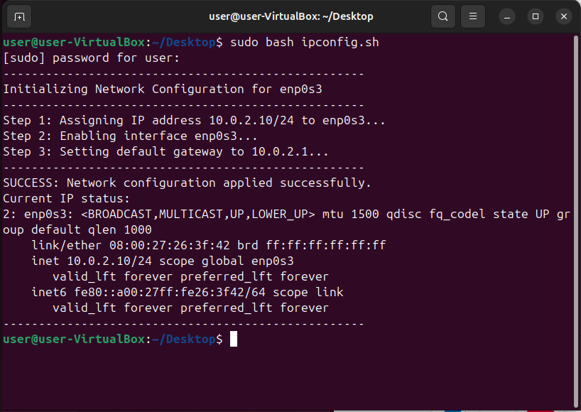
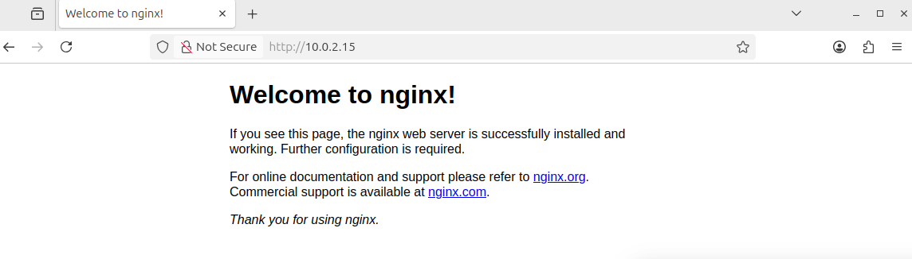
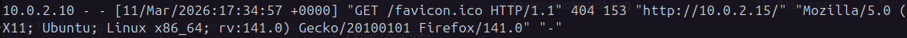
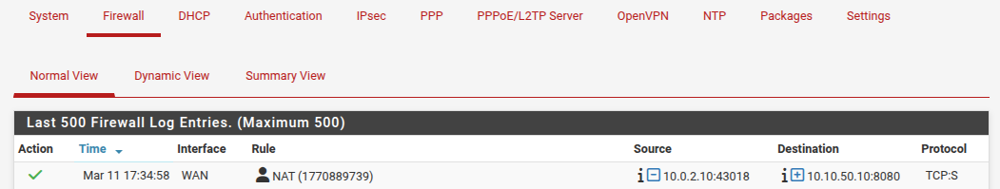

# Phase 08: Service Publication (DNAT & Port Forwarding)

## 🎯 Objective
The objective of this phase was to allow external users to access internal services located in the DMZ in a strictly controlled manner, simulating a real-world production environment.

## 🧠 Security Concept: DNAT (Destination NAT)
In a professional network architecture, internal servers are assigned private IPs that are non-routable on the internet. Port Forwarding, a specific implementation of DNAT, acts as a network "receptionist":
* The external user only knows the public IP of the Firewall (the "main door").
* The Firewall receives the request on a standard port (e.g., 80) and securely redirects it to the internal server providing the service (e.g., Ubuntu DMZ on port 8080).


## 🛠️ Implementation Process

### 1. WAN Security Adjustments (Lab Environment Prep)
To successfully route traffic in a virtualized lab environment, two default pfSense WAN protections were temporarily disabled:

* **Block private networks and loopback addresses:** In a real-world scenario, the WAN receives a public IP. In our lab, the WAN receives a private IP from VirtualBox (or a home router). Disabling this prevents pfSense from mistakenly blocking the traffic as spoofing.
* **Block bogon networks:** VirtualBox internal networks frequently utilize IP ranges that pfSense classifies as "Bogons" (unassigned or reserved IP addresses). Disabling this ensures the virtual machine traffic reaches the NAT engine.

### 2. Port Forwarding Configuration (pfSense)
The NAT rule was configured via `Firewall > NAT > Port Forward` with the following parameters:

| Parameter                | Value           | Technical Justification                                                     |
| :----------------------- | :-------------- | :-------------------------------------------------------------------------- |
| **Interface**            | WAN             | Traffic enters through the external facing interface of the firewall.       |
| **Protocol**             | TCP             | The standard protocol for HTTP web traffic.                                 |
| **Destination Port**     | 80 (HTTP)       | The standard port the external user will request via their browser.         |
| **Redirect Target IP**   | 10.10.50.10     | The internal private IP of our DMZ application server.                      |
| **Redirect Target Port** | 8080            | The specific port where the isolated Docker container is listening.         |
| **Filter Rule Assoc.**   | Associated rule | Automatically generates the corresponding firewall rule to "open the door". |



### 3. External Client Simulation (Ubuntu Desktop)
To validate the architecture, an Ubuntu Desktop VM was configured to act as an external client on the internet.

**A. Hypervisor Network Configuration**
* The VirtualBox network adapter was set to "NAT Network".
* *Requirement:* Both the pfSense WAN and this Ubuntu Desktop must share the same NAT Network to exist on the same external segment.

**B. Network Configuration & Automation Script**
To bypass potential virtualized DHCP issues, the network was initially configured manually using the CLI. However, since the lab environment is frequently restarted, these commands were consolidated into a Bash automation script to streamline the initialization process.

**Script Execution (`ip-config.sh`):**
```bash
#!/bin/bash

# 1. Configuration Variables
# Update these if the network environment changes
INTERFACE="enp0s3"
IP_ADDR="10.0.2.10/24"
GATEWAY="10.0.2.1"

echo "---------------------------------------------------"
echo "Initializing Network Configuration for $INTERFACE"
echo "---------------------------------------------------"

# 2. Check for Root Privileges
# Network configuration commands require administrative power
if [[ $EUID -ne 0 ]]; then
   echo "Error: This script must be run with sudo." 
   exit 1
fi

# 3. Assign IP Address and Subnet Mask
echo "Step 1: Assigning IP address $IP_ADDR to $INTERFACE..."
sudo ip addr add "$IP_ADDR" dev "$INTERFACE"

# 4. Bring the Interface Up
# Ensuring the physical/virtual link is active
echo "Step 2: Enabling interface $INTERFACE..."
sudo ip link set "$INTERFACE" up

# 5. Set the Default Gateway
# Directing all external traffic through the gateway
echo "Step 3: Setting default gateway to $GATEWAY..."
sudo ip route add default via "$GATEWAY"

# 6. Verification
if [ $? -eq 0 ]; then
    echo "---------------------------------------------------"
    echo "SUCCESS: Network configuration applied successfully."
    echo "Current IP status:"
    ip addr show "$INTERFACE"
    echo "---------------------------------------------------"
else
    echo "Error: Network configuration failed. Check your interface name."
    exit 1
fi
```
*You can find the full script in the repository: [scripts/ipconfig.sh](../scripts/ipconfig.sh)*



## ✅ Auditing & Final Verification
The final test consisted of opening Firefox on the external Ubuntu Desktop and navigating to the pfSense WAN IP (`10.0.2.15`).



**Cross-Log Verification:**
1. **Application Level (Docker):** Executing `docker logs -f web-dmz` on the DMZ server successfully displayed the external user's IP, confirming the NAT translation and delivery.
2. **Network Level (pfSense):** Navigating to `Status > System Logs > Firewall` revealed green "Pass" entries on port 80, directly linked to our newly created NAT rule.






---
[⬅️ Back to README](../README.md)