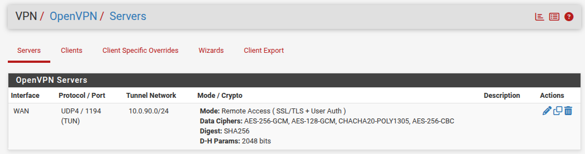
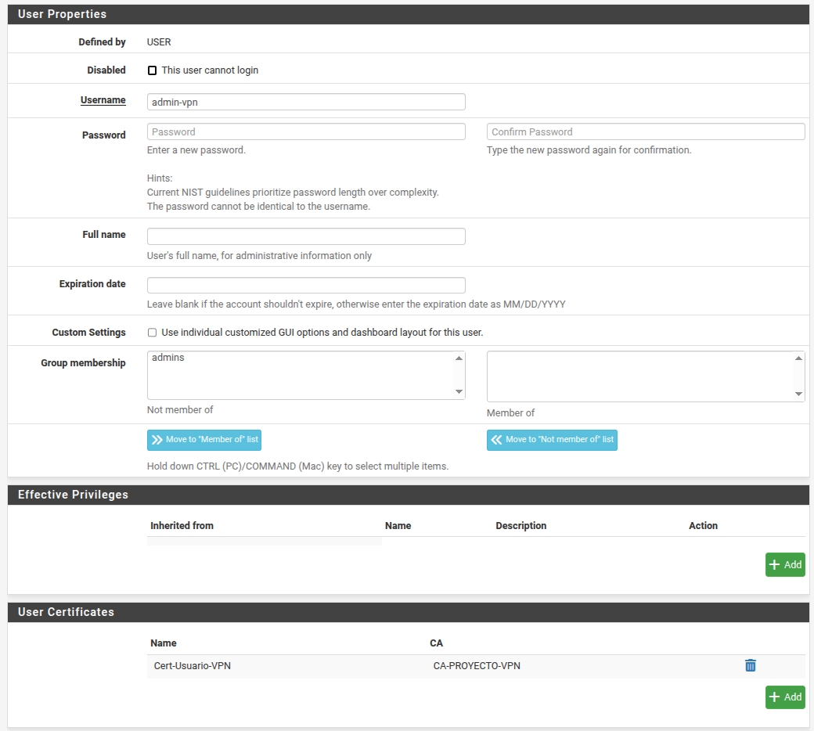
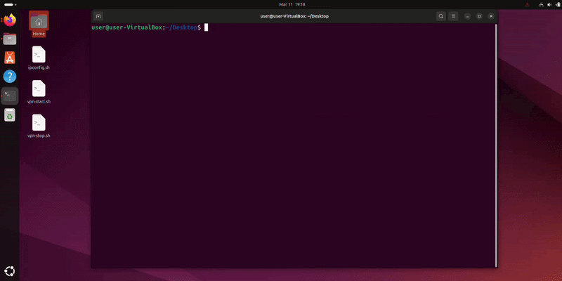
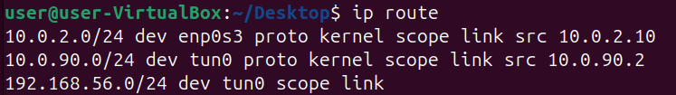
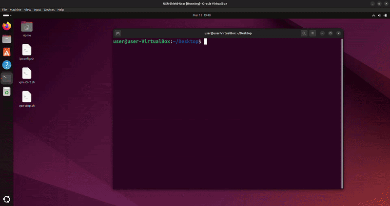

# Phase 09: Secure Remote Access Implementation (OpenVPN)

## 🎯 Objective
The objective of this phase was to deploy a secure Remote Access VPN, allowing an external administrator (simulated via Ubuntu Desktop on a fake WAN) to securely tunnel into the isolated Management Network (MGMT) using encrypted channels, without exposing internal services to the public internet.

## 🔐 1. PKI (Public Key Infrastructure) Foundation
A VPN relying solely on passwords is a security risk. A robust identity verification system was implemented using digital certificates.
* **Certificate Authority (CA):** Created `CA-PROYECTO-VPN` in `System > Cert. Manager > CAs`. This acts as our internal "Notary", cryptographically signing all network permissions.
* **Server Certificate:** Generated a specific certificate for the OpenVPN process, acting as the server's immutable digital ID to prove its authenticity to connecting clients.





## ⚙️ 2. OpenVPN Server Configuration
The OpenVPN was configured with the following critical parameters to balance speed and security:

| Parameter          | Value             | Technical Justification                                                                     |
| :----------------- | :---------------- | :------------------------------------------------------------------------------------------ |
| **Authentication** | Local User Access | Leverages pfSense's internal user database.                                                 |
| **Protocol**       | UDP on IPv4       | UDP is preferred for VPN tunnels as it eliminates TCP handshake overhead, reducing latency. |
| **Interface**      | WAN               | The daemon listens on the external-facing interface.                                        |
| **Port**           | 1194              | The industry standard port for OpenVPN.                                                     |
| **Tunnel Network** | `10.0.90.0/24`    | A virtual subnet dynamically assigned to connected VPN clients.                             |
| **Local Network**  | `192.168.56.0/24` | The internal Management (MGMT) subnet the client needs to reach.                            |

## 🛠️ 3. Troubleshooting & Advanced Routing

Deploying the VPN exposed several advanced system-level challenges that required manual intervention and auditing.

### Challenge A: The "Empty List" Crisis (Certificate Binding)
* **Issue:** After creating the user `admin-vpn`, the Client Export utility showed an empty list of users.
* **Root Cause:** The export plugin strictly requires a user to have a "User Certificate" explicitly signed by the exact same CA that signed the Server Certificate.
* **Resolution:** Edited the user profile, generated a new certificate (`Cert-Usuario-VPN`), and explicitly bound its Issuer to `CA-PROYECTO-VPN`.

### Challenge B: "Route Add Failed" (System Privileges)
* **Issue:** Executing the exported `.ovpn` file resulted in a successful connection, but traffic failed to route. The OS threw a `Linux route add command failed` error.
* **Root Cause:** The Linux host OS blocked the OpenVPN process from modifying the core routing table. The tunnel existed, but packets didn't know how to enter it.
* **Resolution (Manual Route Control):**
  1. Started the VPN explicitly instructing it *not* to touch system routes:
     ```bash
     sudo openvpn --config archivo.ovpn --route-noexec
     ```
  2. Manually injected the route, forcing traffic destined for MGMT into the virtual tunnel interface (`tun0`):
     ```bash
     sudo ip route add 192.168.56.0/24 dev tun0
     ```

### Challenge C: The "Ghost Cable" (Hypervisor Leak)
* **Issue:** A security audit revealed that the Ubuntu client could ping the MGMT network (`192.168.56.10`) even when the VPN was *disconnected*.
* **Root Cause:** VirtualBox was performing background default-gateway routing across its internal virtual adapters, bypassing our simulated isolation.
* **Resolution (Network Isolation):**
  Disabled all adapters on the Ubuntu client except the NAT (Fake Internet) interface. Manually flushed and defined the static IP and gateway to strictly mimic a remote external machine:
  ```bash
  sudo ip addr add 10.0.2.10/24 dev enp0s3
  sudo ip route add default via 10.0.2.1
  ```
  *Validation:* Ping to MGMT immediately failed. It only succeeded once the VPN tunnel and manual route were activated, proving complete cryptographic isolation.


### Process automation using scripts

  **VPN Start Script (`vpn-start.sh`):**
Automates the isolation of the network by removing the default VirtualBox gateway, securely launches the VPN daemon, and injects the static route to the MGMT network only after validating the `tun0` interface.
*Find the script in the repository: [scripts/vpn-start.sh](../scripts/vpn-start.sh)*

```bash
#!/bin/bash

# ==============================================================================
# SCRIPT: vpn-start.sh
# PURPOSE: Securely establishes an OpenVPN tunnel while preventing 
#          Hypervisor Routing Leaks (Bypassing the Firewall).
# ==============================================================================

# 1. Configuration Variables
VPN_CONFIG="$HOME/pfSense-UDP4-1194-admin-vpn-config.ovpn"
TARGET_NETWORK="192.168.56.0/24"
INTERFACE="tun0"
GATEWAY_IP="10.0.2.1"

echo "---------------------------------------------------"
echo "Starting Secure VPN Setup (Hardened Isolation Mode)"
echo "---------------------------------------------------"

# 2. Step 0: Hypervisor Isolation (Zero-Trust Enforcement)
echo "Step 0: Isolating system from implicit hypervisor routing..."
sudo ip route del default via $GATEWAY_IP 2>/dev/null
echo "Isolation Active: Default gateway removed."

# 3. Step 1: Opening credential window
echo "Step 1: Opening credential window..."
gnome-terminal --wait -- bash -c "echo 'SECURE LOGIN'; sudo openvpn --config $VPN_CONFIG --route-noexec --auth-nocache --daemon; echo 'Success! This window will close in 3 seconds...'; sleep 3" &

# 4. Step 2: Monitoring Interface Status
echo "Step 2: Waiting for credentials and $INTERFACE initialization..."
MAX_RETRIES=45
TIMER=0

while ! ip addr show "$INTERFACE" > /dev/null 2>&1; do
    sleep 1
    ((TIMER++))
    
    if (( TIMER % 5 == 0 )); then
        echo "Handshaking... ($TIMER seconds)"
    fi

    if [ $TIMER -ge $MAX_RETRIES ]; then
        echo "Error: Timeout. Interface $INTERFACE did not appear."
        echo "Check credentials or logs."
        sudo ip route add default via $GATEWAY_IP
        exit 1
    fi
done

echo "Success! Tunnel $INTERFACE is now ACTIVE."

# 5. Step 3: Secure Route Injection
echo "Step 3: Injecting management route to $TARGET_NETWORK via $INTERFACE..."
sudo ip route add "$TARGET_NETWORK" dev "$INTERFACE"

# 6. Final Verification
if [ $? -eq 0 ]; then
    echo "---------------------------------------------------"
    echo "AUDIT PASSED: Secure bridge established."
    echo "All management traffic is now ENCAPSULATED."
    echo "Current $INTERFACE Route:"
    ip route show dev "$INTERFACE"
    echo "---------------------------------------------------"
else
    echo "Error: Route injection failed."
    sudo ip route add default via $GATEWAY_IP
    exit 1
fi
```

**VPN Stop Script (`vpn-stop.sh`):**
Restores the environment by cleaning up the static routing table and gracefully terminating the OpenVPN background process.
*Find the script in the repository: [scripts/vpn-stop.sh](../scripts/vpn-stop.sh)*

```bash
#!/bin/bash

# Configuration
TARGET_NETWORK="192.168.56.0/24"

echo "Stopping Management VPN..."

# 1. Remove the static route
sudo ip route del $TARGET_NETWORK > /dev/null 2>&1

# 2. Kill the background OpenVPN process
sudo killall openvpn

echo "MGMNT Network Disconnected and Routes Cleaned."
```

## ✅ Final Validation
The architecture was declared successful after passing three golden tests:
1. **Virtual Interface:** `ip addr` confirmed the creation of `tun0` with the virtual IP `10.0.90.2`.
2. **Routing Table:** `ip route` confirmed `192.168.56.0/24` was securely routed via `dev tun0`.
3. **Encrypted Access:** Successfully opened Firefox on the external client and loaded the pfSense WebGUI via the internal MGMT IP (`https://192.168.56.10`), completely bypassing the WAN.









---
[⬅️ Back to README](../README.md)